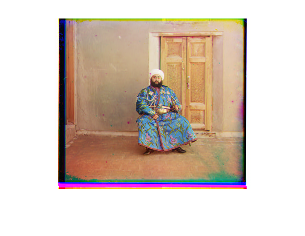
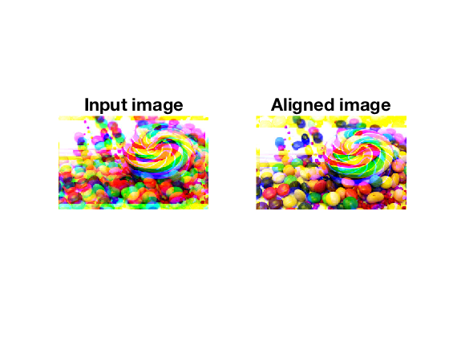

Umich EECS 442 (Winter 2018) homework 1 by Wenzhe Xu

Keywords: color channels alignment, digital camera color demosaicing

## Part 1: Coloring Prokudin-Gorskii images

[Sergei Mikhailovich Prokudin-Gorskii](http://www.loc.gov/exhibits/empire/gorskii.html) was a color photographer far ahead of his time. He was able to produce color pictures even though no color cameras were invented at that time. Each color picture was produced by combining three photos taken with RGB filters.


*Figure 1.1 The left color picture is produced from three images on the right. Filter type: Upper (blue), middle (green), and lower (red). (from [wiki](https://en.wikipedia.org/wiki/Sergey_Prokudin-Gorsky))*

Since these three images for RGB channels are not taken at exactly same slot, three channels are slightly displaced from each other. Alignment among these channel is the key step for color reconstruction. To test whether the alignment is conducted correctly, in this homework, a set of color ground-truth images is given. For each color image, G,B channels are randomly shifted to be G',B' and all three channels (RG'B') are given as inputs. The task is to align from G',B' to G,B. Note that the "predicted" alignment is the inverse of "hidden" shift.

### Coding Contex
The `evalAlignment.m` is the evaluation main function, which compares the "predicted" alignment and "hidden" shift for ten images. It will call the `alignChannels.m` function, which is the only function required to be implemented in this part.

### To Do
* `alignChannels.m` implementation
* `evalAlignment.m` output
* `alignProkudin.m` output

Extra credit
> * **Boundary effects**: Shifting images causes ugly boundary artifacts. Come up with of a way of avoiding this.
> * **Faster alignment**: Searching over displacements can be slow. Think of a way of aligning them faster in a coarse to fine manner. For example you may align the channels by resizing them to half the size and then refining the estimate. This can be done by multiple calls to your alignChannels() function.
> * **Gradient domain alignment**: Instead of aligning raw channels, you might want to align the edges to avoid overdue emphasis on constant intensity regions. You can do this by first computing an edge intensity image and then using your code to align the channels. Look at the edge() function in Matlab.

### Results
Since the shift range is given as `[-15, 15]`x`[-15, 15]`, we uses nested `for` loop to search within the range. For each search location `(i,j)`, align the channel with `(i,j)` amount, calculate the mean squired error (using `immse()`) with respect to the base channel, and update the resultant alignment amount if smaller error is encountered. 

#### `evalAlignment.m` output
```
Evaluating alignment ..
 1 balloon.jpeg
	   gt shift: (-2, 8) (-4, 9)
	 pred shift: ( 2,-8) ( 4,-9)
 2 cat.jpg
	   gt shift: (-10,-2) ( 0, 5)
	 pred shift: (10, 2) ( 0,-5)
 3 ip.jpg
	   gt shift: ( 6,-7) ( 8, 6)
	 pred shift: (-6, 7) (-8,-6)
 4 puppy.jpg
	   gt shift: ( 5,-12) (-10, 0)
	 pred shift: (-5,12) (10, 0)
 5 squirrel.jpg
	   gt shift: (14, 3) (-5,-9)
	 pred shift: (-14,-3) ( 5, 9)
 6 candy.jpeg
	   gt shift: ( 8, 0) (-8, 6)
	 pred shift: (-8, 0) ( 8,-6)
 7 house.png
	   gt shift: (12, 1) (14,-11)
	 pred shift: (-12,-1) (-14,11)
 8 light.png
	   gt shift: (-11,11) (-8,-8)
	 pred shift: (11,-11) ( 8, 8)
 9 sails.png
	   gt shift: (10,13) (-8,-5)
	 pred shift: (-10,-13) ( 8, 5)
10 tree.jpeg
	   gt shift: (-9, 4) (-8,-1)
	 pred shift: ( 9,-4) ( 8, 1)
```
Plots are in `./fig/evalAlignment-plots`.

#### `alignProkudin.m` output
```
1 00125v.jpg shift: B (-4, 1) R (-10,-1)
2 00153v.jpg shift: B (-7,-2) R (-14,-4)
3 00398v.jpg shift: B (-6,-1) R (-11,-4)
4 00149v.jpg shift: B (-5, 0) R (-9,-2)
5 00351v.jpg shift: B (-9,-1) R (-13,-1)
6 01112v.jpg shift: B (-5,-1) R (-5,-1)
```
Plots are in `./fig/prokudin-gorskii-align`.

#### Boundary effects
Since two channels are aligned, not all pixels contain useful information. For example, the following left figure shows the ugly boundary effect. We will use the intersection from all three channels as our infomation window to trim. This information window is defined by `[ulI, ulJ]`x`[brI, brJ]`. It gets updated from the alignment amounts for channel2 and channel3 by the following "find overlapping" algorithm. Another brute-force is to crop the aligned image by 5 percent across the border. Though this method gives a better shape, the "cropped" border may contain significant information. Hence the "triming" method is adoped here.

    
*Figure 1.2 Comparison between alignment without considering boundary effect (upper left) and with trimming (upper right), with cropping (bottom left)*

```matlab
    % 2018-01-22, EECS442 hw1 p1
    % find overlap among rectangles
    function trimed = trim(imShift, predShift)
        shift2i = predShift(1,1);
        shift2j = predShift(1,2);
        shift3i = predShift(2,1);
        shift3j = predShift(2,2);
        ulI = max([1, shift2i, shift3i]);
        ulJ = max([1, shift2j, shift3j]);
        [brI, brJ] = size(imShift(:,:,1));
        brI = min([brI, brI+shift2i, brI+shift3i]);
        brJ = min([brJ, brJ+shift2j, brJ+shift3j]);
        trimed = imShift;
        color = 1; % 1 for white, 0 for black;
        for c = 1:3
            trimed(1:ulI,:,c) = color;
            trimed(brI+1:end,:,c) = color;
            trimed(:,1:ulJ,c) = color;
            trimed(:,brJ+1:end,c) = color;
        end
    end

    % 2018-01-22, EECS 442 hw1 p1
    % crop 5 percent border
    function cropped = crop(imShift)
        [brI, brJ] = size(imShift(:,:,1));
        ulI = uint16(0.05*brI);
        ulJ = uint16(0.05*brJ);
        brI = uint16(0.95*brI);
        brJ = uint16(0.95*brJ);
        cropped = imShift;
        color = 1; % 1 for white, 0 for black;
        for c = 1:3
            cropped(1:ulI,:,c) = color;
            cropped(brI+1:end,:,c) = color;
            cropped(:,1:ulJ,c) = color;
            cropped(:,brJ+1:end,c) = color;
        end
    end
```
#### Faster alignment
Searching alignment region `[-15,15]`x`[-15,15]` with calling `immse` on the fine image is expensive. Hence a coarse-to-fine search strategy is put forward. A series of down-sampled images is generated using `impyramid()`. The figure below shows this series of images with the default reduction radio 2. The coarse image is used to produce a alignment search region for the next more refined image use. Hence, the search region effectively reduces to a quarter of the previous iteration. This process is tested using image `00153v.jpg`. This strategy produces the same alignment solution B (-7,-2) R (-14,-4) with time elapsed 6.8738 seconds compared to the non-Faster alignment with time elapsed 13.4273 seconds.

  
*Figure 1.3 Gaussian Pyramid*

This coarse-to-fine algorithm is shown below.

```matlab
% ... 
    I = channels;
    I1 = impyramid(I, 'reduce');
    I2 = impyramid(I1, 'reduce');
    I3 = impyramid(I2, 'reduce');
    I4 = impyramid(I3, 'reduce');
    
    % Align the blue and red channels to the green channel from coarse to
    % fine image
    tic % start counting time
    [~, predShift] = alignChannelsSpeed(I, [-15,15;-15,15],[-15,15;-15,15]);
    disp(predShift)
    nopyramid = toc % time elapsed for non-Faster alignment 13.4273 sec
    
    radius = [7,7]; % user pre-defined search region.
    [~, predShift] = alignChannelsSpeed(I4, ...
        gSR([0,0],radius),gSR([0,0],radius));
    disp(predShift);
    [~, predShift] = alignChannelsSpeed(I3, ...
        gSR(predShift(1,:),radius),gSR(predShift(2,:),radius));
    disp(predShift);
    [~, predShift] = alignChannelsSpeed(I2, ...
        gSR(predShift(1,:),radius),gSR(predShift(2,:),radius));
    disp(predShift);
    [~, predShift] = alignChannelsSpeed(I1, ...
        gSR(predShift(1,:),radius),gSR(predShift(2,:),radius));
    disp(predShift);
    [~, predShift] = alignChannelsSpeed(I, ...
        gSR(predShift(1,:),radius),gSR(predShift(2,:),radius));
    disp(predShift);
    
    pyramid = toc - nopyramid % time elapsed for Faster alignment 6.8738 sec
% ...

% generate Search Region
function searchRegion = gSR(center,radius)
    % generate a rectangular search region based on center (1x2) and
    % radius(1x2)
    searchRegion = zeros(2,2);
    searchRegion(1,1) = center(1,1) - radius(1,1);
    searchRegion(1,2) = center(1,1) + radius(1,1);
    searchRegion(2,1) = center(1,2) - radius(1,2);
    searchRegion(2,2) = center(1,2) + radius(1,2);
end
```

#### Gradient domain alignment
Overdue emphasis on constant intensity regions may produce misalignment among channels. For example, misalignment using raw channel values for the sixth image "candy" is observed.

  
*Figure 1.3 Alignment without edge extraction*

Edge within a channel matters to the channel alignment. To avoid overdue emphasis on constant intensity regions, we first use `edge()` function to extract edges before any alignments. Different methods are provided in the `edge()` function. The figure below compares these six methods.

  
*Figure 1.4 Comparison among all edge() methods*

In this homework, the `Canny` method is found to outperform other methods across the image set. Hence `Canny` method is adopted.

After trying out this `edge()` preprocessing, "candy" not can be aligned correctly, shown below.

  
*Figure 1.5 Alignment with edge extraction*

## Part 2: Color image demosaicing
Digital sensors arranges RGB sensors in a matrix pattern, called Bayer pattern. Since at centain pixel only one type of sensor can be placed, the values of the other two channels need to be estimated. In this homework, the pattern is arranged in `RGGB` format (see the figure below). Two out of four slots are `green` to record more infomation since human eyes are more sensitive to the green channel. The input to the algorithm is a single image im, which is a `NxM` matrix with values between 0 and 1. The task is to implement three types of interpolation algorithms, called `nearest neighbour`, `linear`, and `weighted gradient averaging`.
 
  
*Figure 2.1 Bayer pattern*

### Coding contex
The `evalDemosaicing.m` is given as the main function to test the correctness of implementation of `demosaicImage.m`. Three mode `nn`, `linear`, and `adagrad` are called and compared for each image from the Ten image set. The `baseline` method is given in the `demosaicImage.m` file. It uses the mean value from all known pixels to estimate the missing channel value. The average error for this method is 0.1392 across the Ten image set. Hence those three methods to be implemented are expected to get smaller error compared to this `baseline` method.
### To Do
* `demosaicImage.m` implementation
* `evalDemosaicing.m` output  

Extra credit  
> * **Transformed color spaces**: Try your previous algorithms by first interpolating the green channel and then transforming the red and blue channels R ← R/G and B ← B/G, i.e., dividing by the green channel and then transforming them back after interpolation. Try other transformations such as logarithm of the ratio, etc (note: you have to apply the appropriate inverse transform). Does this result in better images measured in terms of the mean error? Why is this a good/bad idea?
> * **Digital Prokudin-Gorskii**: Imagine that Prokudin was equipped with a modern digital camera. Compare the resulting demosaiced images to what he obtained using his method of taking three independent grayscale images. Start with the aligned images of your first part and create a mosaiced image by sampling the channels image using the Bayer pattern. Run your demosaicing algorithms and compare the resulting image with the input color image. How much do you lose? Where are the errors?

### Results
#### Interpolation methodology
In this section, the interpolation method for three channels adopted in this homework is shown. Take block `R13 G14 G18 B19` from the image below for example.

  
*Figure 2.2 Interpolation grid*

**`nn`(nearest neighbour)**  
`redChannel`: `R14 <- R13`, `R18 <- R13`, `R19 <- R13`  
`blueChannel`: `B14 <- B9`, `B18 <- B17`, `B13 <- B7`  
`greenChannel`: `G13 <- G12`, `G19 <- G18`  
**`linear`(bilinear average)**  
`redChannel`: `R14 <- (R13 + R15)/2`, `R18 <- (R13 + R23)/2`, `R19 <- (R13 + R15 + R23 + R25)/4`  
`blueChannel`: `B14 <- (B9 + B19)/2`, `B18 <- (B17 + B19)/2`, `B13 <- (B7 + B9 + B17 + B19)/4`  
`greenChannel`: `G13 <- (G8 + G12 + G14 + G18)/4`, `G19 <- (G14 + G18 + G20 + G24)/4`  
**`adagrad`(adaptive gradient)**  
`redChannel`: `R14 <- (R13 + R15)/2`, `R18 <- (R13 + R23)/2`, `R19 <- abs(R13-R25) < abs(R15-R23) ? (R13 + R25)/2 : (R15 + R23)/2`  
`blueChannel`: `B14 <- (B9 + B19)/2`, `B18 <- (B17 + B19)/2`, `B13 <- abs(B7-B19) < abs(B9-B17) ? (B7 + B19)/2 : (B9 + B17)/2`  
`greenChannel`: `G13 <- abs(G8-G18) < abs(G12-G14) ? (G8 + G18)/2 : (G12 + G14)/2`, `G19 <- abs(G14-G24) < abs(G18-G20) ? (G14 + G24)/2 : (G18 + G20)/2`  

Avoid loops for speed in Matlab requires representation various operation as convolution including averaging, and differencing. Remind that the `conv2` function calculates the convolution between two matrices. It can be understood as `rot90` twice and inner product. Hence the following kernels are designed for averaging at various slots (`ul` upper-left, `ur` upper-right, `bl` bottom-left `br` bottom-right).  
**`nn`(nearest neighbour)**  
`redChannel`:  
`k_ur = [0 0 0 ; 0 0 1 ; 0 0 0]`  
`k_bl = [0 0 0 ; 0 0 0 ; 0 1 0]`  
`k_br = [0 0 0 ; 0 0 0 ; 0 0 1]`  
`blueChannel`:  
`k_ur = [0 0 0 ; 0 0 0 ; 0 1 0]`  
`k_bl = [0 0 0 ; 0 0 1 ; 0 0 0]`  
`k_ul = [0 0 0 ; 0 0 0 ; 0 0 1]`  
`greenChannel`:  
`k_ul = [0 0 0 ; 0 0 1 ; 0 0 0]`  
`k_br = [0 0 0 ; 0 0 1 ; 0 0 0]`  
**`linear`(bilinear average)**  
`redChannel`:  
`k_ur = [0 0 0 ; 1 0 1 ; 0 0 0]*0.5`  
`k_bl = [0 1 0 ; 0 0 0 ; 0 1 0]*0.5`  
`k_br = [1 0 1 ; 0 0 0 ; 1 0 1]*0.25`  
`blueChannel`:  
`k_ur = [0 1 0 ; 0 0 0 ; 0 1 0]*0.5`  
`k_bl = [0 0 0 ; 1 0 1 ; 0 0 0]*0.5`  
`k_ul = [1 0 1 ; 0 0 0 ; 1 0 1]*0.25`  
`greenChannel`:  
`k_ul = [0 1 0 ; 1 0 1 ; 0 1 0]*0.25`  
`k_br = [0 1 0 ; 1 0 1 ; 0 1 0]*0.25`  
**`adagrad`(adaptive gradient)**  
`redChannel`:  
`k_ur = [0 0 0 ; 1 0 1 ; 0 0 0]*0.5`  
`k_bl = [0 1 0 ; 0 0 0 ; 0 1 0]*0.5`  
`k_br1 = [1 0 0 ; 0 0 0 ; 0 0 1]*0.5` or `k_br2 = [0 0 1 ; 0 0 0 ; 1 0 0]*0.5`  
`blueChannel`:  
`k_ur = [0 1 0 ; 0 0 0 ; 0 1 0]*0.5`  
`k_bl = [0 0 0 ; 1 0 1 ; 0 0 0]*0.5`  
`k_ul1 = [1 0 0 ; 0 0 0 ; 0 0 1]*0.5` or `k_ul2 = [0 0 1 ; 0 0 0 ; 1 0 0]*0.5`  
`greenChannel`:  
`k_ul1 = [0 1 0 ; 0 0 0 ; 0 1 0]*0.5` or `k_ul2 = [0 0 0 ; 1 0 1 ; 0 0 0]*0.5`  
`k_br1 = [0 1 0 ; 0 0 0 ; 0 1 0]*0.5` or `k_br2 = [0 0 0 ; 1 0 1 ; 0 0 0]*0.5`  
These "or" condition can be determined by comparing two absolute difference of mentioned averaging schemes, which can also be written in the kernel way.  
`redChannel`: 
`k_diff1 = [1 0 0 ; 0 0 0 ; 0 0 -1]`, `k_diff2 = [0 0 1 ; 0 0 0 ; -1 0 0]`  
`blueChannel`:  
`k_diff1 = [1 0 0 ; 0 0 0 ; 0 0 -1]`, `k_diff2 = [0 0 1 ; 0 0 0 ; -1 0 0]`  
`greenChannel`:  
`k_diff_ul1 = [0 1 0 ; 0 0 0 ; 0 -1 0]`, `k_diff_ul2 = [0 0 0 ; 1 0 -1 ; 0 0 0]`  
`k_diff_br1 = [0 1 0 ; 0 0 0 ; 0 -1 0]`, `k_diff_br2 = [0 0 0 ; 1 0 -1 ; 0 0 0]`

Since these kernels assume value zero outside the boundaries when averaging or differerncing, we need to pad the image correctly for the consistence of kernel use. The following padding method is used.

```
    f   e f g h
      ---------
    b | a b c d
    f | e f g h
```

#### `evalDemosaicing.m` output
```
--------------------------------------------------------------
# 	 image 		 baseline 	 nn 		 linear 	 adagrad
--------------------------------------------------------------
1 	 balloon.jpeg 	 0.179239 	 0.019351 	 0.012888 	 0.011223 
2 	 cat.jpg 	 0.099966 	 0.022028 	 0.013414 	 0.013668 
3 	 ip.jpg 	 0.231587 	 0.023795 	 0.014709 	 0.012038 
4 	 puppy.jpg 	 0.094093 	 0.013994 	 0.006133 	 0.005753 
5 	 squirrel.jpg 	 0.121964 	 0.037903 	 0.023119 	 0.024146 
6 	 candy.jpeg 	 0.206359 	 0.038711 	 0.022498 	 0.020952 
7 	 house.png 	 0.117667 	 0.027109 	 0.017257 	 0.015994 
8 	 light.png 	 0.097868 	 0.025561 	 0.017320 	 0.016728 
9 	 sails.png 	 0.074946 	 0.020576 	 0.013650 	 0.012893 
10 	 tree.jpeg 	 0.167812 	 0.025891 	 0.015211 	 0.012593 
--------------------------------------------------------------
 	 average 	 0.139150 	 0.025492 	 0.015620 	 0.014599 
--------------------------------------------------------------
```
Plots are in `./fig/demosaic`.

**Analysis**  
Based on the evaluation, all three implemented methods give better interpolation results compared to the baseline method with a improvement ratio about 10 times. The linear method and the adagrad method outperform the nearest neighbour method since they both smooth the gradient. The error improvement from linear method to adagrad method is small. In fact, whether or not we see the improvement depends on the input images, which is case-by-case as the output shows.

#### Digital Prokudin-Gorskii
Start with the aligned images of the first part and create a mosaiced image by sampling the channels image using the Bayer pattern. Then run the demosaicing algorithms and compare the resulting image with the input color image as below.

  
*Figure 2.3 Digital Prokudin-Gorskii flow output*

To see the difference, calculate the absolute difference between the input color image and interpolated image by calling `imabsdiff()`. The figure below shows the error for each method.

  
*Figure 2.4 Digital Prokudin-Gorskii error for each method*

The linear method and the adaptive gradient method outperform the baseline method and the nearest neighbour method since the black pixels represents no error at these pixels. The error are located at the interpolation pixels, (especially those pixels with large gradient) since the estimation for the constant intensity regions is quite accurate and the estimation for the large transient region has larger error.

